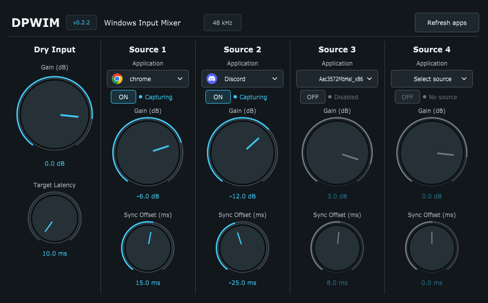

# DirectPipe Windows Input Mixer (DPWIM)

> Mix and synchronize your DAW input with Windows application audio in one
> plugin.
>
> 하나의 플러그인에서 DAW 입력과 Windows 애플리케이션 오디오를 믹스하고
> 동기화하세요.

## DirectPipe 

**[DirectPipe](https://github.com/LiveTrack-X/DirectPipe)** is a cross-platform
real-time VST2/VST3/AU host with plugin-chain processing, fast preset switching,
and external control through hotkeys, MIDI, Stream Deck, WebSocket, and HTTP.

**[DirectPipe](https://github.com/LiveTrack-X/DirectPipe)**는 VST2/VST3/AU
플러그인 체인, 빠른 프리셋 전환, 단축키·MIDI·Stream Deck·WebSocket·HTTP
제어를 지원하는 실시간 오디오 플러그인 호스트입니다.

DPWIM can be loaded by DirectPipe as a regular 64-bit VST2/VST3 effect, but it
does not require DirectPipe and can run independently in another compatible
DAW.

DPWIM은 DirectPipe에서 일반 64-bit VST2/VST3 플러그인으로 사용할 수 있지만,
DirectPipe가 필수는 아니며 다른 호환 DAW에서도 독립적으로 사용할 수
있습니다.

## About DPWIM / DPWIM 소개

**DirectPipe Windows Input Mixer (DPWIM)** is a standalone Windows x64
VST2/VST3 audio-effect plugin that preserves the existing microphone or plugin
chain input and mixes in audio captured from Windows applications or the
desktop.

It provides independent gain, ON/OFF, and ±200 ms synchronization controls for
up to four sources without requiring a virtual audio device. DPWIM is currently
a free GPL-3.0 public preview.

**DirectPipe Windows Input Mixer(DPWIM)**는 기존 마이크·플러그인 체인 입력을
유지하면서 Windows 애플리케이션 또는 데스크톱 오디오를 직접 합성하는
Windows x64 VST2/VST3 플러그인입니다.

최대 4개 소스의 음량, ON/OFF, ±200 ms 싱크를 각각 조절할 수 있으며 별도의
가상 오디오 장치 없이 사용할 수 있습니다. 현재 GPL-3.0 기반의 무료 공개
프리뷰입니다.

**[Download DPWIM v0.3.2 / DPWIM v0.3.2 다운로드](https://github.com/LiveTrack-X/DPWIM/releases/tag/v0.3.2)**

Status: `v0.3.2` public preview. It is locally software-verified, but unsigned,
not DAW-matrix-tested, and not claimed production-ready.

상태: `v0.3.2` 공개 프리뷰입니다. 로컬 소프트웨어 검증은 통과했지만
코드 서명과 광범위한 DAW 호환성 검증은 아직 완료되지 않았습니다.

### v0.3.2 maintenance update / v0.3.2 유지보수 업데이트

- Active-source host-block safety now includes the FIFO drift ratio and
  interpolation requirement, so a 512-frame callback uses a 514-sample floor.
- A larger-than-prepared callback publishes its required floor without
  changing PDC from the audio thread. Captured sources stay muted until the
  host is notified and the next callback adopts the floor.
- FIFO underrun, overflow, explicit discard, and WASAPI discontinuity now
  invalidate stale history, re-prime, and fade captured audio back in.
- Discard no longer rewinds the producer counter while capture is writing.
- Update-check publication is serialized with shutdown.

- 활성 소스의 호스트 블록 안전값에 FIFO drift 비율과 보간 여유를 포함합니다
  (512프레임 콜백은 514샘플 floor).
- 준비 범위보다 큰 콜백은 오디오 스레드에서 PDC를 바꾸지 않고 필요한
  floor만 게시합니다. 호스트 통지 후 다음 콜백이 floor를 채택할 때까지
  캡처 소스는 무음으로 유지됩니다.
- FIFO underrun·overflow·discard·WASAPI discontinuity 뒤에는 부분/오래된
  블록을 섞지 않고 stale history를 무효화한 뒤 재프라임·페이드인합니다.
- capture 쓰기 중 discard가 producer counter를 되감지 않습니다.
- 업데이트 확인 결과 게시와 종료를 직렬화했습니다.

[Full v0.3.2 release notes / 전체 v0.3.2 릴리즈 노트](docs/releases/v0.3.2.md)

The source checkout may contain unreleased work described under `Unreleased`
in the changelog. The download link above remains the latest published build.

현재 소스 체크아웃에는 변경 이력의 `Unreleased` 항목에 적힌 미릴리즈 작업이
포함될 수 있습니다. 위 다운로드 링크는 현재 공개된 최신 빌드를 가리킵니다.

## Signal flow

```text
Host input -> common dry delay ----------------------+
App/Desktop -> process loopback -> FIFO/sync -> pitch +-> mixed output
```

The plugin has no runtime dependency on DirectPipe. DirectPipe can load it as a
normal 64-bit VST2/VST3 effect.



## Current controls

- Base Latency: the user-selected 10-250 ms floor for stable capture and input
  alignment. While any capture source is active, DPWIM automatically raises
  the effective floor when the host block plus FIFO drift/interpolation safety
  needs more time.
- Dry Input ON/OFF: mute the upstream/microphone path without stopping app capture.
- Dry Gain: independent level for the upstream/microphone path.
- Four source slots: one selected application or desktop capture.
- Per-source ON/OFF: suspend capture and mixing without losing the selection.
- Per-source Gain: independent -60 to +12 dB adjustment for every app.
- Per-source Offset: signed -200 to +200 ms manual sync trim.
- Automatic common-timeline rebase: a negative source offset delays the other
  active paths by only the amount needed to keep that source causal.
- OUT latency indicator: shows effective output latency, added sync latency,
  and the sample count reported to the host. It is DPWIM's own delay, not a
  measurement of end-to-end host or device latency.
- Per-source Advanced: Transpose (-12 to +12 semitones) and Fine Pitch
  (-100 to +100 cents).
- Global BYPASS inside DPWIM: immediately passes the raw host input at unity,
  excludes all captured sources and DPWIM processing, and reports zero DPWIM
  latency.
- Host/DAW bypass: remains a separate standard bypass path. It passes raw
  input at the unchanged OUT delay when the host invokes plugin bypass
  processing, so the audio position and PDC report stay consistent. A host
  that removes the plugin node entirely may provide its own immediate bypass.
- Horizontal L/R meters: show each Dry/source contribution after its gain and
  source processing, with a left-to-right dBFS scale, peak hold, and clip
  indication. Meter animation refreshes at 60 Hz. In BYPASS, only the immediate
  raw Dry Input is metered.
- Vertical MAIN OUT meter: shows the final summed stereo output at the far
  right. During BYPASS it follows the raw host input that is passed through.
- Footer status: `Created by LiveTrack` links to the DPWIM repository. When a
  newer GitHub release exists, the full orange
  `Update available | Created by LiveTrack` link opens that release.
- Refresh: updates the selectable Windows process list.

New instances start at the minimum 10 ms Base Latency with Dry Gain and all
source gains at 0 dB. Saved host projects and presets restore their own values.

The meters are informational only: they are not DAW parameters and are not
stored in projects or presets. Mono host input is mirrored across the L/R meter
display.

레벨미터는 정보 표시 전용이며 DAW 파라미터나 프로젝트·프리셋 저장값이
아닙니다. 모노 호스트 입력은 L/R 미터에 동일하게 표시됩니다. Dry와 각
소스의 실제 믹스 기여도를 게인·소스 처리 이후 지점에서 확인할 수 있으며,
바이패스 중에는 즉시 통과하는 원본 Dry Input만 표시합니다.

오른쪽 끝의 세로 MAIN OUT 미터는 모든 경로를 합산한 최종 출력을
표시합니다. 따라서 개별 소스에는 없던 합산 클리핑도 확인할 수 있으며,
바이패스 중에는 실제로 즉시 통과하는 원본 입력을 표시합니다.

`OUT Latency = Base Latency + automatic SYNC addition`. SYNC includes any
active-source host-block safety above Base, negative-offset rebasing, and pitch
processing latency; positive offsets delay only their source. At 48 kHz a new
instance with no active source remains 480 samples. With an active source,
512-frame host callbacks require at least 514 samples.

OUT은 DPWIM이 추가하고 호스트에 보고하는 지연입니다. DirectPipe나 DAW가
표시하는 전체 지연에는 장치 버퍼, 다른 플러그인, 호스트 처리 시간이 더해질
수 있으며 실제 출력-입력 왕복을 측정한 값은 아닙니다. DPWIM 내부 BYPASS는
DPWIM 지연을 0으로 만들지만, 호스트 자체의 체인 바이패스는 별도 경로로
동작합니다. 호스트가 플러그인의 바이패스 처리를 호출하는 동안에는 원음을
기존 OUT 지연에 맞춰 출력하므로 실제 오디오 위치와 PDC 보고가 일치합니다.
호스트가 플러그인 노드를 체인에서 완전히 분리하는 방식이라면 호스트 자체의
즉시 바이패스 동작을 따릅니다.

Each captured source has its own bounded FIFO and drift-correction clock. App
mode includes the selected process tree; desktop mode captures system output
while excluding the current host process tree to reduce feedback.

Prepared active-source callbacks up to 8192 frames are covered without
audio-thread allocation. If a host unexpectedly supplies a larger block, DPWIM
keeps Dry audio running but mutes/re-primes captured sources rather than mixing
a partial block. A larger-than-prepared supported block is observed with an
atomic only; the 60 Hz message-thread timer notifies the host PDC first, and
the next audio callback then adopts the common floor. A discard generation
seen anywhere during FIFO rendering invalidates that complete source block.

Pitch processing adds algorithmic latency; the common timeline and the
OUT/host latency report include it automatically.

피치 처리는 알고리즘 지연을 추가하며, 공통 타임라인과 OUT/호스트 지연
보고에 자동 반영됩니다.

Speed, Tempo, and Loop processing are not part of the current scope.

Speed, Tempo, Loop 처리는 현재 범위에 포함되지 않습니다.

The editor performs one short HTTPS request to GitHub's public latest-release
endpoint once when opened. It sends no project, audio, or user data. Offline or
failed checks stay silent. DPWIM does not download or replace plugin files
automatically.

에디터를 열면 GitHub의 공개 최신 릴리즈 주소를 HTTPS로 한 번 확인합니다.
프로젝트·오디오·사용자 데이터는 전송하지 않으며, 오프라인이거나 확인에
실패하면 별도 경고를 표시하지 않습니다. 플러그인 파일을 자동 다운로드하거나
교체하지는 않습니다.

## Requirements

- Windows 10 build 20348 or later
- Visual Studio 2022 C++ toolchain
- CMake 3.22+
- Network access for the pinned JUCE fetch, or a local JUCE source override
- Optional valid VST2 SDK headers for the VST2 target

## Build

```powershell
cmake -S . -B build -DDPWIM_BUILD_TESTS=ON
cmake --build build --config Release --parallel
ctest --test-dir build -C Release --output-on-failure
```

To enable VST2 without copying its SDK into the repository:

```powershell
cmake -S . -B build `
  -DDPWIM_VST2_SDK_PATH=C:/path/to/VST2_SDK `
  -DDPWIM_BUILD_TESTS=ON
```

VST2 headers are not redistributed. DPWIM source and release binaries are
licensed under GPL-3.0-only; see `LICENSE`. Release binaries are currently
unsigned.

## Local verification

The current Windows checkout has passed:

```powershell
ctest --test-dir build -C Release --output-on-failure
.\build\Release\dpwim-loopback-smoke.exe
.\build\Release\dpwim-plugin-probe.exe `
  '.\build\DPWIM_artefacts\Release\VST3\DirectPipe Windows Input Mixer.vst3' `
  '.\build\DPWIM_artefacts\Release\VST\DirectPipe Windows Input Mixer.dll'
```

The loopback smoke test plays a tone in its own process and verifies captured
frames and non-zero energy. The host probe scans and instantiates both formats,
checks the dry impulse against reported latency, and round-trips plugin state.

Manual validation in DirectPipe and representative third-party DAWs is still
required before a stable/general-compatibility claim.

## AI-assisted development / AI 보조 개발

DPWIM is developed with substantial assistance from AI coding tools, primarily
Codex. The initial ideas, product direction, and basic structure of selected
documents are owner-led; scope, priorities, and final acceptance decisions
remain owner-led as well.

DPWIM uses the
[SDAD Protocol](https://github.com/LiveTrack-X/spec-driven-ai-development)
(SPEC-Directed AI Development), developed alongside this work, as a
repository-local development control layer. It keeps the active scope,
validation evidence, unresolved findings, and owner gates for actions such as
releases or public compatibility changes explicit. SDAD controls the
development workflow only and is not part of the DPWIM runtime.
AI-assisted output is reviewed and validated where possible, but AI use does
not itself guarantee correctness or replace owner responsibility.

DPWIM은 주로 Codex 같은 AI 코딩 도구의 상당한 보조를 받아 개발합니다.
초기 아이디어, 제품 방향, 일부 문서의 기본 구조는 소유자가 정하며,
범위·우선순위·최종 승인 결정도 소유자가 맡습니다.

이 작업과 함께 개발한
[SDAD Protocol](https://github.com/LiveTrack-X/spec-driven-ai-development)
(SPEC-Directed AI Development)을 저장소 내부의 개발 제어 계층으로
사용합니다. SDAD는 현재 범위, 검증 증거, 미해결 항목, 릴리즈나 공개 호환성
변경 같은 행동의 소유자 게이트를 명시적으로 관리합니다. SDAD는 개발
워크플로만 제어하며 DPWIM 런타임의 일부가 아닙니다. AI 보조 산출물은
가능한 범위에서 검토·검증하지만, AI 사용 자체가 정확성을 보장하거나
소유자의 책임을 대체하지는 않습니다.

## License

Copyright (c) 2026 LiveTrack-X.

DPWIM is free software licensed under the GNU General Public License version 3
only (`GPL-3.0-only`).
